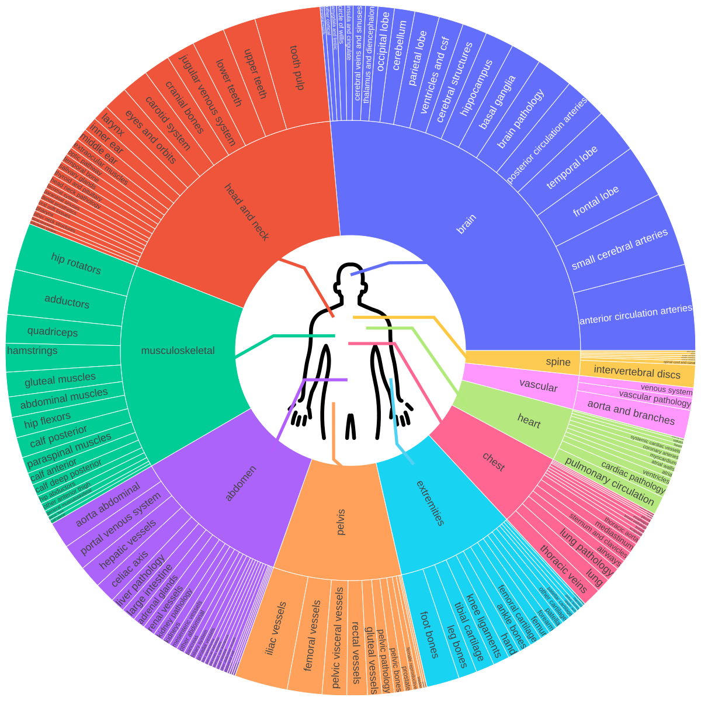
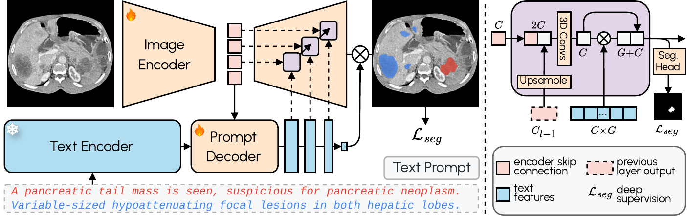

# [CVPR2026] VoxTell: Free-Text Promptable Universal 3D Medical Image Segmentation

<div align="center">

[](https://arxiv.org/abs/2511.11450)&#160;
[](https://github.com/MIC-DKFZ/VoxTell)&#160;
[](https://huggingface.co/mrokuss/VoxTell)&#160;
[](https://github.com/gomesgustavoo/voxtell-web-plugin)&#160;
[](https://github.com/CCI-Bonn/OHIF-AI)&#160;
[](https://github.com/lassoan/SlicerVoxTell)
[](https://github.com/MIC-DKFZ/napari-voxtell)&#160;

</div>


This repository contains the official implementation of our paper:

### **VoxTell: Free-Text Promptable Universal 3D Medical Image Segmentation**

VoxTell is a **3D vision–language segmentation model** that directly maps free-form text prompts, from single words to full clinical sentences, to volumetric masks. By leveraging **multi-stage vision–language fusion**, VoxTell achieves state-of-the-art performance on anatomical and pathological structures across CT, PET, and MRI modalities, excelling on familiar concepts while generalizing to related unseen classes.

> **Authors**: Maximilian Rokuss*, Moritz Langenberg*, Yannick Kirchhoff, Fabian Isensee, Benjamin Hamm, Constantin Ulrich, Sebastian Regnery, Lukas Bauer, Efthimios Katsigiannopulos, Tobias Norajitra, Klaus Maier-Hein  
> **Paper**: [](https://arxiv.org/abs/2511.11450)

---

## 📰 News

- **03/2026**: 🥇 First place on the [official ReXGroundingCT benchmark](https://rexrank.ai/ReXGroundingCT/index.html)
- **02/2026**: 📄 VoxTell was accepted at CVPR 2026!
- **02/2026**: 🎉 The community built a VoxTell web interface - thank you! 👉 [voxtell-web-plugin](https://github.com/gomesgustavoo/voxtell-web-plugin)
- **01/2026**: 🧩 Model checkpoint **v1.1** released and now available with official napari plugin 👉 [napari-voxtell](https://github.com/MIC-DKFZ/napari-voxtell)
- **12/2025**: 🚀 `VoxTell` launched with a **Python backend** and **PyPI package** (`pip install voxtell`)

## Overview

VoxTell is trained on a **large-scale, multi-modality 3D medical imaging dataset**, aggregating **158 public sources** with over **62,000 volumetric images**. The data covers:

- Brain, head & neck, thorax, abdomen, pelvis  
- Musculoskeletal system and extremities  
- Vascular structures, major organs, substructures, and lesions  



This rich semantic diversity enables **language-conditioned 3D reasoning**, allowing VoxTell to generate volumetric masks from flexible textual descriptions, from coarse anatomical labels to fine-grained pathological findings.

---

## Architecture

VoxTell combines **3D image encoding** with **text-prompt embeddings** and **multi-stage vision–language fusion**:

- **Image Encoder**: Processes 3D volumetric input into latent feature representations
- **Prompt Encoder**: We use the fozen [Qwen3-Embedding-4B](https://huggingface.co/Qwen/Qwen3-Embedding-4B) model to embed text prompts
- **Prompt Decoder**: Transforms text queries and image latents into multi-scale text features
- **Image Decoder**: Fuses visual and textual information at multiple resolutions using MaskFormer-style query-image fusion with deep supervision



---

## 🛠 Installation

### 1. Create a Virtual Environment

VoxTell supports Python 3.10+ and works with Conda, pip, or any other virtual environment manager. Here's an example using Conda:

```bash
conda create -n voxtell python=3.12
conda activate voxtell
```

### 2. Install PyTorch

> [!WARNING]
> **Temporary Compatibility Warning**  
> There is a known issue with **PyTorch 2.9.0** causing **OOM errors during inference** (related to 3D convolutions — see the PyTorch issue [here](https://github.com/pytorch/pytorch/issues/166122)).  
> **Until this is resolved, please use PyTorch 2.8.0 or earlier.**

Install PyTorch compatible with your CUDA version. For example, for Ubuntu with a modern NVIDIA GPU:

```bash
pip install torch==2.8.0 torchvision==0.23.0 --index-url https://download.pytorch.org/whl/cu126
```

*For other configurations (macOS, CPU, different CUDA versions), please refer to the [PyTorch Get Started](https://pytorch.org/get-started/previous-versions/) page.*

Install via pip (you can also use [uv](https://docs.astral.sh/uv/)):

```bash
pip install voxtell
```

or install directly from the repository:

```bash
git clone https://github.com/MIC-DKFZ/VoxTell
cd VoxTell
pip install -e .
```

---

## 🚀 Getting Started

👉 NEW: [Try VoxTell interactively in the napari viewer](https://github.com/MIC-DKFZ/napari-voxtell)

You can download VoxTell checkpoints using the Hugging Face `huggingface_hub` library:

```
from huggingface_hub import snapshot_download

MODEL_NAME = "voxtell_v1.1" # Updated models may be available in the future
DOWNLOAD_DIR = "/home/user/temp" # Optionally specify the download directory

download_path = snapshot_download(
      repo_id="mrokuss/VoxTell",
      allow_patterns=[f"{MODEL_NAME}/*", "*.json"],
      local_dir=DOWNLOAD_DIR
)

# path to model directory, e.g., "/home/user/temp/voxtell_v1.1"
model_path = f"{download_path}/{MODEL_NAME}"
```

### Command-Line Interface (CLI)

VoxTell provides a convenient command-line interface for running predictions:

```bash
voxtell-predict -i input.nii.gz -o output_folder -m /path/to/model -p "liver" "spleen" "kidney"
```

**Single prompt:**
```bash
voxtell-predict -i case001.nii.gz -o output_folder -m /path/to/model -p "liver"
# Output: output_folder/case001_liver.nii.gz
```

**Multiple prompts (saves individual files by default):**
```bash
voxtell-predict -i case001.nii.gz -o output_folder -m /path/to/model -p "liver" "spleen" "right kidney"
# Outputs: 
#   output_folder/case001_liver.nii.gz
#   output_folder/case001_spleen.nii.gz
#   output_folder/case001_right_kidney.nii.gz
```

**Save combined multi-label file:**
```bash
voxtell-predict -i case001.nii.gz -o output_folder -m /path/to/model -p "liver" "spleen" --save-combined
# Output: output_folder/case001.nii.gz (multi-label: 1=liver, 2=spleen)
# ⚠️ WARNING: Overlapping structures will be overwritten by later prompts
```

#### CLI Options

| Argument | Short | Required | Description |
|----------|-------|----------|-------------|
| `--input` | `-i` | Yes | Path to input NIfTI file |
| `--output` | `-o` | Yes | Path to output folder |
| `--model` | `-m` | Yes | Path to VoxTell model directory |
| `--prompts` | `-p` | Yes | Text prompt(s) for segmentation |
| `--device` | | No | Device to use: `cuda` (default) or `cpu` |
| `--gpu` | | No | GPU device ID (default: 0) |
| `--save-combined` | | No | Save multi-label file instead of individual files |
| `--verbose` | | No | Enable verbose output |

---

### Python API

For more control or integration into Python workflows, use the Python API:

```python
import torch
from voxtell.inference.predictor import VoxTellPredictor
from nnunetv2.imageio.nibabel_reader_writer import NibabelIOWithReorient

# Select device
device = torch.device("cuda:0" if torch.cuda.is_available() else "cpu")

# Load image
image_path = "/path/to/your/image.nii.gz"
img, _ = NibabelIOWithReorient().read_images([image_path])

# Define text prompts
text_prompts = ["liver", "right kidney", "left kidney", "spleen"]

# Initialize predictor
predictor = VoxTellPredictor(
      model_dir="/path/to/voxtell_model_directory",
      device=device,
)

# Run prediction
# Output shape: (num_prompts, x, y, z)
voxtell_seg = predictor.predict_single_image(img, text_prompts)
```

#### Optional: Visualize Results

You can visualize the segmentation results using [napari](https://napari.org/):

```bash
pip install napari[all]
```

> 💡 **Tip**  
> If you work in napari already, the [napari-voxtell plugin](https://github.com/MIC-DKFZ/napari-voxtell) offers the fastest way to explore VoxTell results interactively.


```python
import napari
import numpy as np

# Create a napari viewer and add the original image
viewer = napari.Viewer() 
viewer.add_image(img, name='Image')

# Add segmentation results as label layers for each prompt
for i, prompt in enumerate(text_prompts):
      viewer.add_labels(voxtell_seg[i].astype(np.uint8), name=prompt)

# Run napari
napari.run()
```

## Important: Image Orientation and Spacing

- ⚠️ **Image Orientation (Critical)**: For correct anatomical localization (e.g., distinguishing left from right), images **must be in RAS orientation**. VoxTell was trained on data reoriented using [this specific reader](https://github.com/MIC-DKFZ/nnUNet/blob/86606c53ef9f556d6f024a304b52a48378453641/nnunetv2/imageio/nibabel_reader_writer.py#L101). Orientation mismatches can be a source of error. An easy way to test for this is if a simple prompt like "liver" fails and segments parts of the spleen instead. Make sure your image metadata is correct.

- **Image Spacing**: The model does not resample images to a standardized spacing for faster inference. Performance may degrade on images with very uncommon voxel spacings (e.g., super high-resolution brain MRI). In such cases, consider resampling the image to a more typical clinical spacing (e.g., 1.5×1.5×1.5 mm³) before segmentation.

---

## 🗺️ Roadmap

- [x] **Paper Published**: [arXiv:2511.11450](https://arxiv.org/abs/2511.11450)
- [x] **Code Release**: Official implementation published
- [x] **PyPI Package**: Package downloadable via pip
- [x] **Model Release**: Public availability of pretrained weights
- [x] **Napari Plugin**: Integration into the napari viewer as a [plugin](https://github.com/MIC-DKFZ/napari-voxtell)
- [ ] **Fine-Tuning**: Support and scripts for custom fine-tuning

---

## Citation

```bibtex
@misc{rokuss2025voxtell,
      title={VoxTell: Free-Text Promptable Universal 3D Medical Image Segmentation}, 
      author={Maximilian Rokuss and Moritz Langenberg and Yannick Kirchhoff and Fabian Isensee and Benjamin Hamm and Constantin Ulrich and Sebastian Regnery and Lukas Bauer and Efthimios Katsigiannopulos and Tobias Norajitra and Klaus Maier-Hein},
      year={2025},
      eprint={2511.11450},
      archivePrefix={arXiv},
      primaryClass={cs.CV},
      url={https://arxiv.org/abs/2511.11450}, 
}
```

---

## 📬 Contact

For questions, issues, or collaborations, please contact:

📧 maximilian.rokuss@dkfz-heidelberg.de / moritz.langenberg@dkfz-heidelberg.de